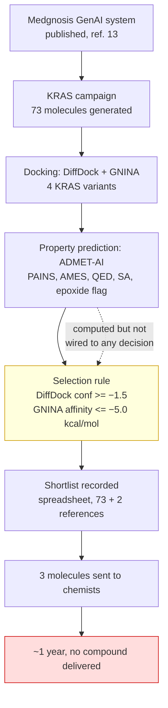
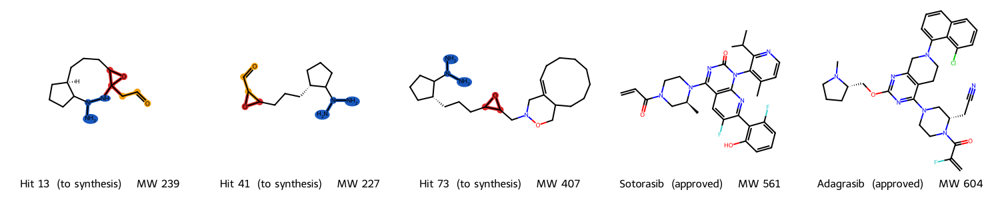
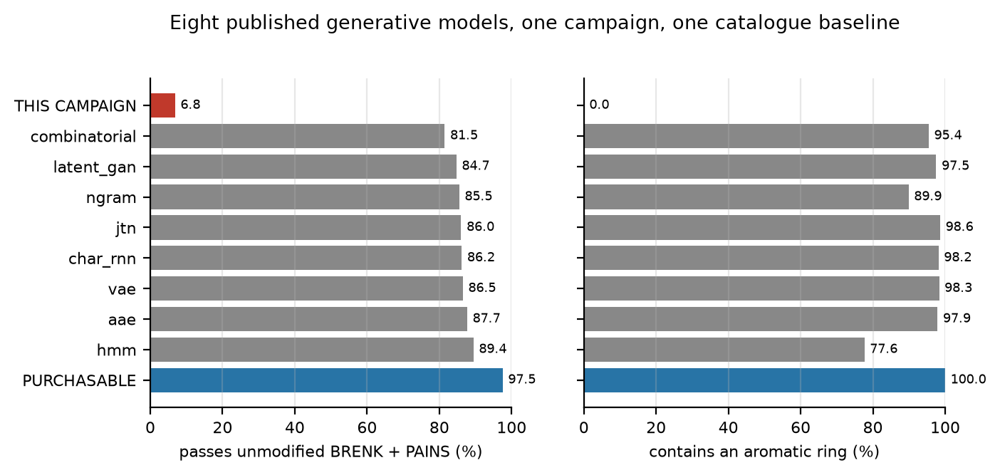
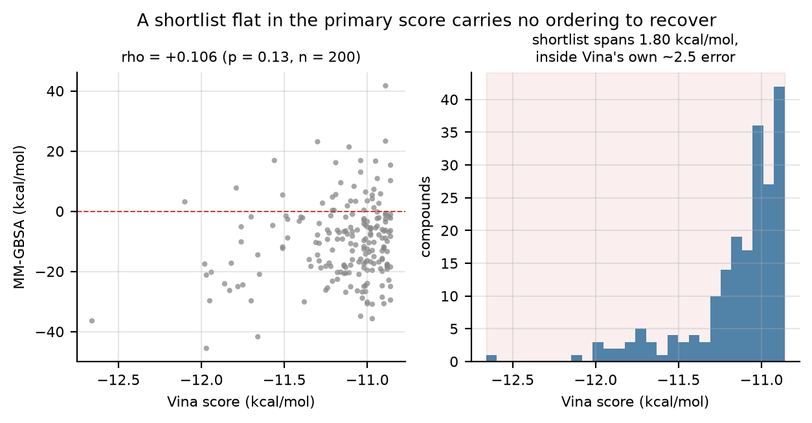
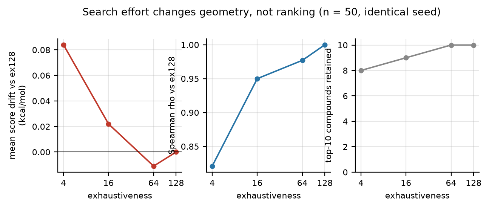
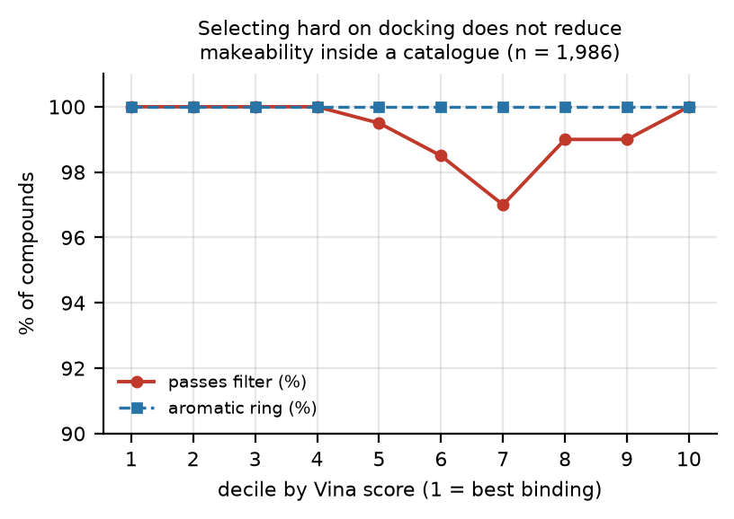
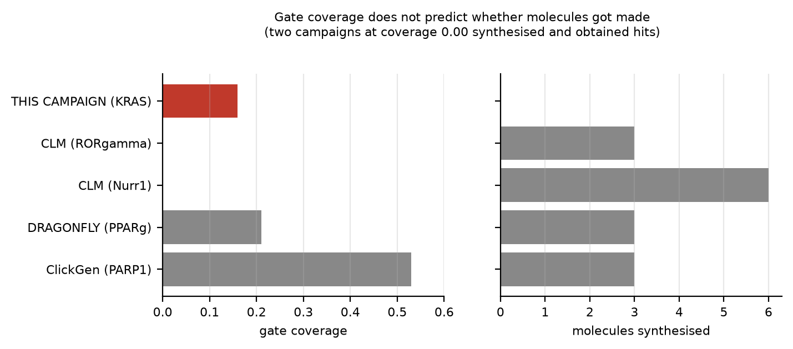

# Computed but not consulted

## A self-audit of a generative drug-discovery campaign against KRAS in pancreatic cancer

**Obi Ebuka David**, Autogon Inc. Correspondence: davidobi023@gmail.com

## Abstract

We report a self-audit of a generative small-molecule campaign against KRAS in pancreatic
ductal adenocarcinoma, conducted by the authors of the generative system. It produced 73
candidate molecules; three were sent to synthetic chemists and approximately one year of
laboratory work produced no compound. The failure was not one of prediction. The campaign's
own output file contains a column named "Epoxide Ring Present", set True for all three
molecules sent for synthesis. The same file records predicted mutagenicity at a median of 0.93 across all 73 molecules and
synthetic accessibility at 5.47 against 4.21 and 3.84 for the two reference drugs. Every
signal required to halt the campaign was computed, written down, and shipped, and none was
connected to a decision. Selection used docking thresholds alone, and the one criterion with
authority over the outcome, "Good Docking Quality Overall", reads True for 72 of 73
molecules. Against a control of 240,214 molecules from eight published
generative models, this is not a general property of generative chemistry: those models pass
an unmodified published filter at 81 to 89 percent, against 6.8 percent here. The
distinguishing feature was not the generator but the absence of any gate between prediction
and purchase order. We rebuild the pipeline so that every stage must reproduce
known answers before its output is used, and report four validated targets, three completed
screens, and two occasions on which our own replacement methods failed in the same manner
and were caught by those gates. We also report four hypotheses we proposed for the failure and could not
support, including our own, and state where the surviving claim is bounded: the audit is of
a single campaign, the laboratory outcome is attested rather than documented, and no
compound has been measured. Code, data, and all negative results are released.

## 1. Introduction

Computational drug-discovery pipelines are assembled from components that are individually
validated and collectively unaudited. A generative model proposes molecules, a docking
method scores them, property predictors annotate them, and a shortlist emerges. Each
component has a literature establishing what it does well. Very little establishes what
happens when they are chained and the chain is trusted.

The limitations of the individual components are known. Generative models propose molecules
that cannot readily be synthesised (ref. 1). Structural-alert catalogues over-reject, and
Capuzzi et al. report that **87 small-molecule FDA-approved drugs carry PAINS alerts**,
cautioning explicitly against using such alerts to triage compounds (refs. 2, 3).
Deep-learning docking methods produce physically invalid poses (ref. 4). The field has also
been reviewed recently and comprehensively (ref. 14), and that review is accompanied by a
curated compilation of 73 generative campaigns that reached experimental validation, which
we use as the comparison class throughout this paper. We claim novelty for none of these.

That compilation also sets the scale against which this campaign must be judged. Across the
56 entries carrying a numeric hit rate, **239 of 459 synthesised compounds were active at
10 micromolar or better, a pooled hit rate of 52 percent**, with a median of 5 compounds
synthesised per campaign. Generative design routinely reaches the bench and routinely works.
Any account of the failure reported here has to explain why this campaign did not, against
73 that did.

What this paper contributes is a chain with **ground truth at the end of it**. The molecules
did not stop at a benchmark. Three went to synthetic chemists, and the synthesis did not
succeed. That allows a question the literature rarely gets to ask: when a computational
campaign fails at the bench, was the information needed to prevent it absent, or present and
unused?

For this campaign the answer is unambiguous and is the paper's central finding. The
information was present, in the campaign's own spreadsheet, in a column named after the
functional group that broke the chemistry.

We are the authors of the generative system audited here (ref. 13). This is a self-audit,
and we regard that as a strength of the evidence rather than a limitation of it: we hold the
primary artefacts, including the failure.

## 2. Provenance of the material audited



**Figure 1. The chain, and where it breaks.** Property prediction (D) fed the record but not
the decision (E). The dotted edge is the paper's subject.

The chain from published method to bench failure is summarised in Figure 1. The
generative system and its selection rule are published (ref. 13): molecules were
retained on a DiffDock confidence threshold of −1.5 and a GNINA minimised affinity of
≤ −5.0 kcal/mol, with ADMET-AI (ref. 12) descriptors computed alongside. No stability or
reactivity criterion appears in the method. The campaign output analysed here is the
spreadsheet released with this paper, containing 73 generated molecules and two reference
drugs, sotorasib (ref. 9) and adagrasib (ref. 10).

## 3. Results

### 3.1 The failure was recorded in the file that recommended the molecules

The campaign's output file carries 32 columns. Among them is `Epoxide Ring Present`.

**Table 1. What the campaign computed about the molecules it selected.**

| quantity recorded | value across 73 generated molecules | reference drugs |
|---|---|---|
| `Epoxide Ring Present`, the three sent to synthesis | **True, all three** | not applicable |
| `Epoxide Ring Present`, all molecules | True for 13 of 73 | False |
| `AMES` (predicted mutagenicity), median | **0.93** | not applicable |
| `QED` (drug-likeness), median | 0.39 | typical norm > 0.5 |
| `Synthesis Accessibility Score`, median | 5.47 (22 of 73 above 6.0) | **4.21, 3.84** |
| `PAINS` | flagged 4 of 73 | not flagged |
| `Good Docking Quality Overall` | **True for 72 of 73** | not applicable |
| `FDA Approved` | False for 73 of 73 | not applicable |

Three molecules were selected for synthesis: Hit 13, Hit 41 and Hit 73 (Figure 2). Each has
`Epoxide Ring Present = True`. Epoxides are strained three-membered ethers, opened by
nucleophiles, acids and bases, and in these structures they co-occur with hydrazines and
free aldehydes that attack them. The audit script identifies twelve molecules whose own
functional groups react with one another, including all three synthesis candidates.

The signal was not weak, ambiguous or buried. It was a boolean column named after the
offending group, set to True, in the file used to choose what to make.



**Figure 2. The three molecules sent to synthetic chemists, beside the two reference drugs
in the same file.** Red, epoxide. Blue, hydrazine or triazane nitrogen. Orange, free
aldehyde. Structures drawn from the SMILES strings in Table 2; no atom has been moved or
omitted.

**Table 2. The three synthesis candidates as recorded in the campaign output.**
SMILES strings are listed verbatim beneath the table.

| molecule | MW | SA score | aromatic ring | groups present |
|---|---|---|---|---|
| Hit 13 | 239 | 5.24 | **no** | epoxide, hydrazine, triazane, aldehyde |
| Hit 41 | 227 | 4.60 | **no** | epoxide, hydrazine, triazane, aldehyde |
| Hit 73 | 407 | 5.29 | **no** | epoxide, hydrazine, triazane |
| Sotorasib (ref. 9) | 561 | 3.84 | yes | none of the above |
| Adagrasib (ref. 10) | 604 | 4.21 | yes | none of the above |

SMILES as recorded in the campaign output file:

```
Hit 13   NN(N1)C2CCC[C@H1]2CCCC3OC31CC=O
Hit 41   NN(N)C1CCC[C@H1]1CCCC2OC2C=O
Hit 73   NN(N)C1CCC[C@H1]1CCCC2OC2CN(OCC3CCCCCCCC=4)CC=43
```

Each of the three carries **an epoxide and a hydrazine in the same molecule**. A hydrazine is
a strong nucleophile and an epoxide is a strained electrophile; they consume one another.
Two of the three additionally carry a free aldehyde, which condenses with the hydrazine to a
hydrazone. Every one contains a triazane, a nitrogen-nitrogen-nitrogen chain that is
notoriously unstable.

The two approved drugs sit in the same spreadsheet, carry none of these groups, contain
aromatic rings, and are roughly twice the molecular weight. The comparison was available at
the moment of selection.

### 3.2 The failure is not a property of generative models

If generative models generally produced unmakeable molecules, this campaign would be an
instance of a known problem rather than a finding. We tested that directly against the
released outputs of eight published generative models, applying **BRENK and PAINS exactly as
shipped in RDKit**, with none of our own modifications.

**Table 3. One filter battery, unmodified published catalogues, applied across models.**

| set | n | pass filter | aromatic ring | median MW |
|---|---|---|---|---|
| Purchasable compounds (ZINC) | 30,000 | **97.5%** | 100.0% | 523.6 |
| HMM | 3,381 | 89.4% | 77.6% | 108.1 |
| AAE | 27,730 | 87.7% | 97.9% | 323.4 |
| VAE | 29,297 | 86.5% | 98.3% | 306.4 |
| CharRNN | 29,653 | 86.2% | 98.2% | 310.4 |
| JT-VAE | 30,000 | 86.0% | 98.6% | 307.8 |
| NGram | 7,134 | 85.5% | 89.9% | 233.3 |
| LatentGAN | 26,799 | 84.7% | 97.5% | 307.4 |
| Combinatorial | 30,000 | 81.5% | 95.4% | 325.4 |
| **This campaign** | **73** | **6.8%** | **0.0%** | 226.3 |



**Figure 3. One filter battery across nine sources.** Left, fraction passing unmodified
BRENK and PAINS as shipped in RDKit (ref. 21). Right, fraction containing an aromatic ring.
Red, the audited campaign. Blue, purchasable compounds. Grey, eight published generative
models whose released outputs are distributed with the MOSES benchmark (ref. 15).

Eight published models, 240,214 molecules, pass at 81 to 89 percent (Figure 3). This campaign passes at
6.8 percent, and **not one of its 73 molecules contains an aromatic ring**, against 95 to 99
percent for every model tested and 100 percent for purchasable compounds. Both reference
drugs contain aromatic rings.

The generative literature does not have this problem. This campaign did. The difference lies
in what was permitted to stop a molecule, not in what produced it.

*A methodological note on this table.* The filters are unmodified. Had we applied our own
tuned catalogue, the separation would be uninterpretable, because we would have built the
instrument that produced it.

### 3.3 The same unmodified filter rejects both approved drugs

Applying that identical unmodified catalogue to the two reference drugs:

**Table 4. The filter that separates the sets also rejects the drugs.**

| molecule | status | passes unmodified BRENK + PAINS |
|---|---|---|
| Sotorasib | approved KRAS G12C inhibitor (ref. 9) | **No** |
| Adagrasib | approved KRAS G12C inhibitor (ref. 10) | **No** |

Both fail, on the acrylamide warhead that BRENK flags as `Michael_acceptor_1` (ref. 5). The
alert fires on the feature responsible for the drug's mechanism.

This is the second half of the problem and it points the opposite way. Used as a gate without
calibration, the same catalogue that correctly rejects this campaign's molecules also rejects
the two drugs the campaign was trying to emulate. A filter is not a gate until something has
established which of its verdicts to believe.

### 3.4 Three mechanisms of silent failure, five instances

Re-running each component of the vetting stack against molecules whose correct classification
is known yields five failures. They reduce to three mechanisms.

**Table 5. Failures grouped by mechanism.**

| mechanism | instance | consequence |
|---|---|---|
| **M1. Over-broad structural alert** | BRENK `Michael_acceptor_1` on acrylamide | rejects sotorasib and adagrasib |
| | Nitroso SMARTS `[NX3]-[OX2H0,OX1]` also matches nitro | rejects venetoclax |
| | Alkyne rule in our own stability gate | rejects MRTX1133 (ref. 7) |
| **M2. Threshold not fitted to the chemotype** | ADMET DILI < 0.70 and hERG < 0.70 (ref. 12) | rejects 199 of 200, including both approved drugs |
| **M3. Tool answers a different question** | Retrosynthesis (ref. 11) as a feasibility gate | ranks an impossible molecule above a marketed drug |

We report three mechanisms rather than five failures deliberately. Grouping is the honest
description, and the recurrence of M1 across three independent implementations, two of them
widely used and one written by us, is stronger evidence than five unrelated defects would be.

For M3, the numbers: retrosynthesis returns **80 percent of precursors in stock over 6 steps**
for an impossible molecule ("Hit 41", which carries both an epoxide and a hydrazine that opens
it) and **71 percent over 6 steps** for adagrasib. A formal disconnection exists for a molecule
that decomposes on formation. Retrosynthesis answers "if this existed, what would assemble it"
and never "can this exist".

In every instance the tool returned well-formed output and raised no error.

### 3.5 The intervention: panels, not references

All five instances are detected by requiring each tool to reproduce known answers before its
output is used. The operative variable is panel size.

**Table 6. Detection as a function of control-panel size.**

| control set | size | instances detected |
|---|---|---|
| Reference compounds | 3 | **0 of 5** |
| Calibration panel | 14 | **5 of 5** |

The panel spans the target class, approved covalent inhibitors, and structurally diverse
marketed drugs. Cost is one function call per tool invocation. In the rebuilt pipeline the
ADMET stage re-runs its control check on every invocation and exits if any control fails.

### 3.6 The rebuilt pipeline, and what its gates cost

Eleven phases, each with a known-answer gate. **Nine of the eleven gates exist because a tool
had already failed silently.**

**Table 7. Method validation across four targets.**

| variant | structure | cognate redock RMSD | control spread | criterion |
|---|---|---|---|---|
| G12C | 8AFB | 0.67 Å | 2.96 kcal/mol | < 2.0 Å |
| G12D | 9HFK | 0.88 Å | 4.84 kcal/mol | < 2.0 Å |
| G12V | 9YMQ | 1.55 Å | not recorded | < 2.0 Å |
| G12R | 9XB7 (1.36 Å) | 0.99 Å | 3.13 kcal/mol | < 2.0 Å |

The method replaced was blind docking with CNN rescoring, which showed **4.0 kcal/mol
run-to-run variance on a single molecule** (sotorasib scored −3.80 and −7.78 on repeat runs)
and therefore could not rank.

**Target selection by disease prevalence.** Among 3,755 PDAC tumours carrying a codon-12 KRAS
mutation, the distribution is **G12D 47%, G12V 34%, G12R 17%, G12C 2%** (ref. 8). *(Denominator:
codon-12-mutant tumours. As fractions of all PDAC, approximately 40, 29, 14 and 1.7 percent.)*
The audited campaign's docking columns lead with **G12C**, the variant with approved drugs and
abundant liganded structures, and the one accounting for 2 percent of this disease. Structure
availability selected the target; prevalence did not.

**Screens.** From 518,662 gated purchasable compounds: G12D n = 19,639, G12V n = 9,913,
covering 81 percent of codon-12-mutant PDAC. Neither produced a compound competitive with the
clinical inhibitors. A G12R screen is in progress.

### 3.7 Our replacement methods failed in the same way, and the gates caught them

Two failures occurred in the pipeline built to prevent failures. Both were detected by control
gates, which is the intervention demonstrating itself on its authors.

**A ligand scored outside the protein.** Our MM-GBSA implementation initially scored a conformer
re-embedded from SMILES rather than the docked pose, placing ligand and receptor in unrelated
coordinate frames. The **crystallographic** cognate ligand of 9YMQ scored **+23.44 kcal/mol**,
non-binding, and impossible for a ligand resolved within that structure. Scoring the docked pose
gives **−33.22 kcal/mol**. The gate that caught it required the cognate ligand to score as a
binder.

**A gate that did not check what it claimed.** An earlier version of that same gate counted
returned results rather than testing the ranking its documentation promised, and allowed the
broken run to proceed for 37 minutes. A gate that does not check what it claims to check is
indistinguishable from no gate. This is the paper's thesis, applied to the authors, and it is
the reason we report it.

**Rescoring cannot rank a shortlist flat in the primary score.**

**Table 8. Two independent rescoring methods on the G12V top-200.**

| quantity | value |
|---|---|
| Vina score spread across all 200 compounds | **1.80 kcal/mol** |
| Vina's documented error (ref. 6) | ~2.5 kcal/mol |
| MM-GBSA spread, same compounds | 87.28 kcal/mol |
| Spearman ρ, Vina vs MM-GBSA (n = 200) | **+0.106** (p = 0.13) |
| Spearman ρ, Vina vs Vinardo (n = 200) | +0.259 |
| Shared compounds in the two top-10 rankings | **2 of 10** |



**Figure 4. A flat shortlist carries no ordering to recover.** Left, MM-GBSA against Vina
for all 200 G12V compounds. Right, the Vina score distribution, spanning 1.80 kcal/mol
against a documented method error of about 2.5 kcal/mol.

Neither rescoring method is malfunctioning (Figure 4). The shortlist spans less than the primary method's
own error and carries no ordering to recover. Reported without the primary spread, ρ = 0.106
reads as a failed rescoring method rather than a property of the input. Interim estimates during
the run were 0.239 (n = 50), 0.347 (n = 60), 0.196 (n = 80) and 0.106 (n = 200); the apparent
significance at n = 60 (p = 0.007) was a sampling artefact, and we report it to document how
unstable small-n correlations are in this setting.

**Search effort buys geometry, not ranking.** Every screen ran at docking exhaustiveness 4 while
every validation gate ran at 16, so the gate never covered the configuration used.

**Table 9. Exhaustiveness sensitivity, 50 compounds, identical embedding seed.**

| exhaustiveness | mean Δ vs ex128 | ρ vs ex128 | top-10 retained | median cost |
|---|---|---|---|---|
| 4 | **+0.08 kcal/mol** | 0.821 | 8 of 10 | 24 s |
| 16 | +0.02 | 0.950 | 9 of 10 | 94 s |
| 64 | −0.01 | 0.977 | 10 of 10 | 347 s |
| 128 | 0.00 | 1.000 | 10 of 10 | 747 s |



**Figure 5. Search effort changes geometry, not ranking.** Fifty compounds docked at four
exhaustiveness levels with an identical embedding seed, so the only variable is the search.
Left, mean score drift against the deepest search. Centre, rank correlation. Right, top-10
compounds retained.

A 31-fold compute increase moves the median score by 0.08 kcal/mol (Figure 5), so the completed screens are
sound. The same parameter on G12R moved the cognate's score only from −9.28 to −9.80 while moving
its **pose from 7.19 Å to 0.99 Å**, converting a failed validation into a passed one. Screening
consumes rank and tolerates shallow search; validation and pose-dependent rescoring consume
geometry and do not.

### 3.8 Selecting hard on docking does not, by itself, reduce makeability

If a docking objective pulled a pipeline away from real chemistry, the effect should be
visible inside a purchasable library. We tested this on 1,986 G12D-screened purchasable
compounds, binned into deciles by Vina score.



**Figure 6. Docking rank against makeability, inside a catalogue.** Unmodified filter pass
rate and aromatic content by Vina decile, best binding on the left.

**Table 10. Makeability is flat across the docking range.**

| decile | Vina range (kcal/mol) | passes filter | aromatic | median MW |
|---|---|---|---|---|
| 1 (best) | −12.50 to −10.01 | 100.0% | 100% | 520.5 |
| 2 | −10.00 to −9.57 | 100.0% | 100% | 516.2 |
| 5 | −9.03 to −8.76 | 99.5% | 100% | 517.6 |
| 7 | −8.45 to −8.15 | 97.0% | 100% | 516.7 |
| 10 (worst) | −7.03 to −4.51 | 100.0% | 100% | 533.6 |

There is no gradient (Figure 6). Selecting hard on a docking objective is safe when the search space is
a catalogue, because the catalogue bounds the search to chemistry that exists. The failure
documented here therefore required **both** an unconstrained generative search space **and**
the absence of any criterion able to reject a molecule. Neither alone reproduces it.

We report this because it refutes a mechanism we ourselves proposed on the strength of
section 3.2, and because it is the control a reader is entitled to demand.

### 3.9 Gate coverage does not predict whether molecules get made

The obvious explanation for the campaign's failure is that too few of its computed
properties were wired to decisions. We defined **gate coverage** as the fraction of computed
property types carrying a threshold able to remove a molecule, and tested whether it
separates successful campaigns from this one.

Papers were drawn as a seeded random sample from the curated corpus of 73 generative
campaigns with experimental validation compiled by Du et al. (ref. 14). Scoring followed a
rubric fixed before any paper was read (released with this manuscript). Four of twelve
sampled papers were retrievable as open-access full text and were scored.



**Figure 7. Gate coverage against outcome.** Left, fraction of computed properties able to
halt the pipeline. Right, molecules actually synthesised. Red, the audited campaign.

**Table 11. Pilot survey of gate coverage (n = 4 scored, rubric fixed in advance).**

| campaign | ref. | computed | gating | coverage | stability gate | synthesised | hits |
|---|---|---|---|---|---|---|---|
| ClickGen (PARP1) | 17 | 15 | 8 | **0.53** | **yes** | 3 | 2 |
| DRAGONFLY (PPAR-gamma) | 18 | 14 | 3 | 0.21 | no | 3 | 2 |
| CLM (Nurr1) | 19 | 8 | 0 | **0.00** | no | 6 | 2 |
| CLM (ROR-gamma) | 20 | 4 | 0 | **0.00** | no | 3 | **3** |
| This campaign | 13 | 19 | 3 | 0.16 | no | **0** | 0 |

**The hypothesis fails** (Figure 7). Two campaigns with gate coverage of zero synthesised their designs
and obtained hits, one of them three from three at 0.37 micromolar (ref. 20). Automated gate
coverage does not distinguish them from a campaign that produced nothing.

What the ROR-gamma paper does record is a different kind of gate. Its first round of designs
was judged "synthetically inaccessible by medicinal chemists", retrosynthetic analysis "did
not find a synthetic route", and that assessment prompted a revision of the method rather
than an order for synthesis (ref. 20). The gate existed, it was a person, and it fired before
money was spent. The campaign audited here has no equivalent step in its record: the
spreadsheet in section 3.1 was produced and three molecules were requested from chemists.

The claim that survives is narrower than the one we set out to make, and is about process
rather than tooling. **A criterion capable of stopping the pipeline must exist and must be
consulted. It does not have to be automated, and automating it is not sufficient.**

### 3.10 Three hypotheses of ours, tested and refuted

We state these together because the pattern is the paper's most useful methodological
content.

**Table 12. Hypotheses proposed during this work and their outcomes.**

| hypothesis | test | outcome |
|---|---|---|
| Generative models produce molecules that cannot be made | filter battery, 240,214 molecules, 8 models (3.2) | **refuted**, they pass at 81 to 89 percent |
| Goal-directed optimisation degrades makeability | decile analysis (3.8), plus 50 goal-directed campaigns pooling a 50 percent hit rate (ref. 14) | **refuted** |
| Low gate coverage explains the failure | pilot survey, 4 campaigns (3.9) | **refuted**, two campaigns at coverage 0.00 succeeded |

Each was plausible, each would have made a more quotable paper, and each was removed by a
control we ran on ourselves. What remains is a single documented negative case with an
unusually complete audit trail, set against 73 positive controls from the literature.

### 3.11 The 2025 campaign and the rebuilt pipeline, stage by stage

Table 13 sets the audited campaign beside its replacement. The 2025 column is taken from the
published method (ref. 13) and from the column headings of the output file itself; it is not
a characterisation. The last two columns record only one thing about each stage: whether it
could remove a molecule. **GATE** means it could, **rank** means it ordered molecules without
removing any, and **none** means the stage produced a record only.

**Table 13. Campaign as run in 2025 against the rebuilt pipeline.** *The 2025 column is drawn
from a published method; the rebuilt column is our own account of our own unpublished system.
The evidential standards are not equal and the comparison should be read accordingly.*

| stage | 2025 campaign | rebuilt pipeline | 2025 | now |
|---|---|---|---|---|
| Target choice | G12C leads the docking columns | chosen by PDAC prevalence (ref. 8); cognate ligand required | none | **GATE** |
| Method validation | none reported | cognate redock RMSD < 2.0 A | none | **GATE** |
| Scoring reliability | not assessed | 4.0 kcal/mol variance measured, method replaced | none | **GATE** |
| Docking | DiffDock blind, GNINA rescoring | site-directed Vina 1.2.7 (ref. 6) | rank | rank |
| Library | generated, unconstrained | 518,662 purchasable, MW-windowed | none | **GATE** |
| Chemical reality | epoxide and PAINS flags computed | 14-drug calibration panel must survive | none | **GATE** |
| Selection heuristic | not applicable | similarity plus diversity, validated vs random | none | rank |
| Selection rule | DiffDock >= -1.5, GNINA <= -5.0 | docking rank after all gates pass | **GATE** | **GATE** |
| ADMET | AMES, ClinTox, QED, Lipinski computed | thresholds from approved controls; exits on failure | none | **GATE** |
| Synthetic accessibility | SA score computed, median 5.47 | retrosynthesis plus chemoselectivity check | none | **GATE** |
| Independent rescoring | none | MM-GBSA, gated on the cognate scoring as a binder | none | **GATE** |
| Laboratory capture | none | specified, **not built** | none | none |
| **Stages able to stop a molecule** | | | **1 of 12** | **9 of 12** |

Two features of this table matter more than the rest.

**Most of the 2025 stages existed.** The campaign computed reactive-group flags, PAINS,
mutagenicity and synthetic accessibility. In seven of the twelve rows the difference is not
whether a property was calculated but whether the calculation could remove a molecule. One
stage in the 2025 campaign could stop a molecule; nine can now.

**The rebuilt pipeline has not produced a compound either.** It has produced four validated
targets, three completed screens and a set of gates, and no purchase order. On the only
measure that finally matters, a molecule in a vial with a number attached, the two columns
read the same. The difference claimed here is in what is known about why, not in a better
outcome.

## 4. Discussion

The components of this stack behaved as documented. Structural alerts over-rejected, as Capuzzi
et al. described (ref. 2). Retrosynthesis did not model stability, which it never claimed to.
Docking scores were noisy within their stated error. Nothing malfunctioned.

What failed was the architecture. Property prediction produced a record; selection consulted a
threshold. Between the column reporting an epoxide and the decision to synthesise the molecule
carrying it, there was no connection. The campaign could see, and could not act on what it saw.

This distinction matters because it changes the remedy. If the problem were prediction quality,
the response would be better predictors, and the field is well supplied with those. If the
problem is that predictions are recorded rather than enforced, better predictors change nothing.
The remedy is architectural: every stage must be able to stop the pipeline, and must first
demonstrate on known answers that it stops the right things.

The benchmark in §3.2 supports this reading. Eight published models produce broadly makeable
molecules without any special stability machinery, because they imitate training distributions
drawn from real chemistry. This campaign selected against docking thresholds and departed from
that distribution, with nothing positioned to notice. **Not one of its 73 molecules has an
aromatic ring**, a feature present in essentially every drug-like compound and in both its own
reference drugs. A single aromaticity check would have flagged the entire set.

The pilot survey (section 3.9) constrains this further than we would like. Two campaigns
with no automated gates at all synthesised their molecules and obtained hits. The mechanism
cannot therefore be gate coverage as a number. What distinguishes the successful campaigns
in the sample is that a criterion, in one documented case a medicinal chemist's judgement,
was positioned to reject designs and did so before synthesis was commissioned. The
architectural claim survives; its automated form does not.

We report our own two failures for the same reason we report the campaign's. A paper arguing
that computational tools fail silently would be self-refuting if it presented its own tools as
having worked first time. The relevant difference is that ours were caught, by gates, before
anything was ordered.

## 5. Limitations

**One campaign, no control campaign.** We cannot separate "the vetting architecture failed" from
"this particular campaign was unusual". The benchmark in §3.2 bounds the second possibility but
does not eliminate it.

**The synthesis record is not in our possession.** The approximately one-year effort is reported
from institutional memory. No laboratory notebook, dated protocol or chemist's report accompanies
this paper. Readers should treat the bench outcome as attested rather than documented, and the
computational audit, which is fully reproducible, as the evidential core.

**n = 73.** The audited set is small. All per-molecule claims are stated with counts.

**The 14-drug panel is sufficient, not optimal.** It detects these five instances. Minimal
sufficient panel construction is open.

**One target family.** All docking results are KRAS.

**The gate-coverage survey is a pilot, n = 4.** Twelve papers were sampled at random from
the corpus; eight were not retrievable as open-access full text. Four scored papers cannot
establish a population claim, and the survey is reported as refuting our hypothesis rather
than establishing its replacement. A full survey requires institutional access and is the
obvious next step.

**Three of our own hypotheses were refuted during this work** (section 3.10). We report them
rather than the tidier account that would have followed from stopping earlier, because the
refutations bound what the surviving claim can carry.

**Self-audit.** We built the system audited here. This gives us the primary artefacts and an
obvious interest in the interpretation. All data and code are released so the analysis can be
repeated against us.

## 6. Methods

**Software.** AutoDock Vina 1.2.7 (ref. 6); RDKit 2026.03 (BRENK and PAINS catalogues as
shipped); OpenMM 8.6 with openmmforcefields, openff-toolkit and AmberTools (AM1-BCC charges via
antechamber), ff14SB with GBn2 implicit solvent; AiZynthFinder with USPTO policy and ZINC stock
(ref. 11); ADMET-AI (ref. 12); Meeko for ligand preparation; PDBFixer for receptor preparation.

**Structures.** 8AFB (G12C), 9HFK (G12D), 9YMQ (G12V), 9XB7 (G12R, 1.36 Å). Intake required a
co-crystallised drug-like ligand. Docking boxes were the ligand extent plus 10 Å per dimension.

**Filter battery (§3.2).** BRENK and PAINS as shipped in RDKit, no exemptions. Generated sets are
the released samples of the eight MOSES baseline models, capped at 30,000 molecules each.
Molecules failing SMILES parsing are excluded and counted.

**Gates.** Cognate redock RMSD < 2.0 Å; survival of a 14-drug panel; approved-control retention in
ADMET; stability gate before retrosynthesis; cognate ligand scoring as a binder with sensible
control ordering in MM-GBSA.

**Statistics.** Spearman rank correlation throughout, reported with n. Interim estimates are
reported alongside final values where they differ materially.

## 7. Data and code availability

`github.com/eobi/pancreatic_cancer_research` contains code, gated libraries, screening results,
rescoring outputs, the filter battery, and all validation records **including failed validations**.
The G12R validation that failed at 7.19 Å is retained alongside the one that passed at 0.99 Å. A
record containing only successes cannot support a methodological claim.

## 8. References

1. Gao, W. & Coley, C. W. The Synthesizability of Molecules Proposed by Generative Models. *J. Chem. Inf. Model.* **60**, 5714-5723 (2020). doi:10.1021/acs.jcim.0c00174
2. Capuzzi, S. J., Muratov, E. N. & Tropsha, A. Phantom PAINS: Problems with the Utility of Alerts for Pan-Assay INterference CompoundS. *J. Chem. Inf. Model.* **57**, 417-427 (2017). doi:10.1021/acs.jcim.6b00465
3. Baell, J. B. & Nissink, J. W. M. Seven Year Itch: Pan-Assay Interference Compounds (PAINS) in 2017, Utility and Limitations. *ACS Chem. Biol.* **13**, 36-44 (2018). doi:10.1021/acschembio.7b00903
4. Buttenschoen, M., Morris, G. M. & Deane, C. M. PoseBusters: AI-based docking methods fail to generate physically valid poses or generalise to novel sequences. *Chem. Sci.* **15**, 3130-3139 (2024). doi:10.1039/D3SC04185A
5. Brenk, R. et al. Lessons Learnt from Assembling Screening Libraries for Drug Discovery for Neglected Diseases. *ChemMedChem* **3**, 435-444 (2008). doi:10.1002/cmdc.200700139
6. Eberhardt, J., Santos-Martins, D., Tillack, A. F. & Forli, S. AutoDock Vina 1.2.0: New Docking Methods, Expanded Force Field, and Python Bindings. *J. Chem. Inf. Model.* **61**, 3891-3898 (2021). doi:10.1021/acs.jcim.1c00203
7. Wang, X. et al. Identification of MRTX1133, a Noncovalent, Potent, and Selective KRAS-G12D Inhibitor. *J. Med. Chem.* **65**, 3123-3133 (2022). doi:10.1021/acs.jmedchem.1c01688
8. Ardalan, B., Ciner, A., Baca, Y. et al. Distinct Molecular and Clinical Features of Specific Variants of KRAS Codon 12 in Pancreatic Adenocarcinoma. *Clin. Cancer Res.* **31**, 1082-1090 (2025). doi:10.1158/1078-0432.CCR-24-3149
9. Canon, J. et al. The clinical KRAS(G12C) inhibitor AMG 510 drives anti-tumour immunity. *Nature* **575**, 217-223 (2019). doi:10.1038/s41586-019-1694-1
10. Hallin, J. et al. The KRAS-G12C Inhibitor MRTX849 Provides Insight toward Therapeutic Susceptibility of KRAS-Mutant Cancers in Mouse Models and Patients. *Cancer Discov.* **10**, 54-71 (2020). doi:10.1158/2159-8290.CD-19-1167
11. Genheden, S. et al. AiZynthFinder: a fast, robust and flexible open-source software for retrosynthetic planning. *J. Cheminform.* **12**, 70 (2020). doi:10.1186/s13321-020-00472-1
12. Swanson, K. et al. ADMET-AI: a machine learning ADMET platform for evaluation of large-scale chemical libraries. *Bioinformatics* **40**, btae416 (2024). doi:10.1093/bioinformatics/btae416
13. Obi, E. D., Yentumi, J. A., Mbatuegwu, D., Ayobami, F. & Obi, T. Generating Novel Small Molecule Drugs for Selected SARS-CoV-2 Proteins: The Medgnosis GenAI Approach. *Advances in Multidisciplinary and Scientific Research Journal* **10**(4), 7-18 (2024). doi:10.22624/AIMS/V10N4P1
14. Du, Y. et al. Machine learning-aided generative molecular design. *Nature Machine Intelligence* **6**, 589-604 (2024). doi:10.1038/s42256-024-00843-5
15. Polykovskiy, D. et al. Molecular Sets (MOSES): A Benchmarking Platform for Molecular Generation Models. *Front. Pharmacol.* **11** (2020). doi:10.3389/fphar.2020.565644
16. Brown, N., Fiscato, M., Segler, M. H. S. & Vaucher, A. C. GuacaMol: Benchmarking Models for de Novo Molecular Design. *J. Chem. Inf. Model.* **59**, 1096-1108 (2019). doi:10.1021/acs.jcim.8b00839
17. Wang, et al. ClickGen: Directed exploration of synthesizable chemical space via modular reactions and reinforcement learning. *Nat. Commun.* **15** (2024). doi:10.1038/s41467-024-54456-y
18. Atz, K. et al. Prospective de novo drug design with deep interactome learning. *Nat. Commun.* **15** (2024). doi:10.1038/s41467-024-47613-w
19. Ballarotto, M. et al. De Novo Design of Nurr1 Agonists via Fragment-Augmented Generative Deep Learning. *J. Med. Chem.* **66**, 8170-8177 (2023). doi:10.1021/acs.jmedchem.3c00485
20. Moret, M. et al. Beam Search for Automated Design and Scoring of Novel ROR Ligands with Machine Intelligence. *Angew. Chem. Int. Ed.* **60**, 19477-19482 (2021). doi:10.1002/anie.202104405
21. RDKit: Open-source cheminformatics. https://www.rdkit.org

## Supplementary reference list: gate-coverage survey corpus

The papers below are the contemporary campaigns (2024 to 2026) retrieved as the sampling frame
for the gate-coverage survey in section 3.9. They are listed so the frame is inspectable, and
are not cited individually in the argument.

22. Gusrin et al. Comprehensive Molecular Docking and Molecular Dynamics Reveal Inhibitors of HER2 L755S, T798I, and T798M based on a Large Database of Curcumin Derivatives. *Asian Pacific Journal of Cancer Prevention* **27**, 265-279, (2026). doi:10.31557/apjcp.2026.27.1.265
23. Guzmán-Flores et al. In Silico Identification of Dual-Action Compounds Targeting TLR2 and Streptococcus mutans Proteins for the Prevention of Early Childhood Caries. *Dentistry Journal* **14**, 301, (2026). doi:10.3390/dj14050301
24. Iqbal et al. Computational-experimental integration identifies potent carbohydrate-hydrolyzing enzyme inhibitors from Nardostachys jatamansi: molecular docking, dynamics and pharmacokinetic predictions. *Frontiers in Pharmacology* **16**, (2026). doi:10.3389/fphar.2025.1713452
25. Soares et al. Integrative proteome-wide structural analysis and high-throughput docking identify broad-spectrum antiviral scaffolds against Zika, Yellow Fever, West Nile, Saint Louis encephalitis, and Usutu viruses. *Frontiers in Cellular and Infection Microbiology* **16**, (2026). doi:10.3389/fcimb.2026.1723132
26. Yu et al. AI-driven virtual screening platform identifies novel NSUN2 inhibitor candidates for targeted cancer therapy: a computational drug discovery approach. *npj Precision Oncology* **10**, (2026). doi:10.1038/s41698-026-01296-2
27. Al Khzem et al. In Silico Lead Identification of Staphylococcus aureus LtaS Inhibitors: A High-Throughput Computational Pipeline Towards Prototype Development. *International Journal of Molecular Sciences* **26**, 12038, (2025). doi:10.3390/ijms262412038
28. Alanzi et al. Discovery of ROCK2 inhibitors through computational screening of ZINC database: Integrating pharmacophore modeling, molecular docking, and MD simulations. *PLOS One* **20**, e0323781, (2025). doi:10.1371/journal.pone.0323781
29. Ali et al. Computational discovery of BRD4 inhibitors for neuroblastoma therapy using pharmacophore screening and molecular simulations. *Scientific Reports* **15**, (2025). doi:10.1038/s41598-025-20714-2
30. Cabrera et al. CADD-based discovery of novel oligomeric modulators of PKM2 with antitumor activity in aggressive human glioblastoma models. *Heliyon* **11**, e42238, (2025). doi:10.1016/j.heliyon.2025.e42238
31. Gakpey et al. Targeting aldose reductase using natural African compounds as promising agents for managing diabetic complications. *Frontiers in Bioinformatics* **5**, (2025). doi:10.3389/fbinf.2025.1499255
32. García et al. AI-Driven De Novo Design and Development of Nontoxic DYRK1A Inhibitors. *Journal of Medicinal Chemistry* **68**, 10346-10364, (2025). doi:10.1021/acs.jmedchem.5c00512
33. Han et al. Virtual screening, optimization design, and synthesis analysis of novel benzofuran derivatives as pan-genotypic HCV NS5B polymerase inhibitors using molecular modeling. *BMC Chemistry* **19**, (2025). doi:10.1186/s13065-025-01575-2
34. Hassan et al. Structure-guided virtual screening reveals phytoconstituents as potent cathepsin B inhibitors: Implications for cancer, traumatic brain injury, and Alzheimer’s disease. *Frontiers in Molecular Biosciences* **12**, (2025). doi:10.3389/fmolb.2025.1581711
35. Islam et al. Conditioned Generative Modeling of Molecular Glues: A Realistic AI Approach for Synthesizable Drug-like Molecules. *Biomolecules* **15**, 849, (2025). doi:10.3390/biom15060849
36. Islam et al. Investigating new drugs from marine seaweed metabolites for cervical cancer therapy by molecular dynamic modeling approach. *Scientific Reports* **15**, (2025). doi:10.1038/s41598-024-82043-0
37. Jadhav et al. Unlocking the therapeutic potential of unexplored phytocompounds as hepatoprotective agents through integration of network pharmacology and in-silico analysis. *Scientific Reports* **15**, (2025). doi:10.1038/s41598-025-92868-y
38. Kamel et al. Mechanism-based inhibition of squalene epoxidase by phenothiazines for lipid metabolism disruption using repurposed antipsychotic drugs. *Scientific Reports* **15**, (2025). doi:10.1038/s41598-025-13282-y
39. Kaviyarasu et al. Virtual screening and molecular dynamics of anti-Alzheimer compounds from Cardiospermum halicacabum via GC-MS. *Frontiers in Chemistry* **13**, (2025). doi:10.3389/fchem.2025.1586728
40. Kotadiya et al. In silico identification of prospective p53-MDM2 inhibitors from ASINEX database using a comprehensive molecular modelling approach. *Scientific Reports* **15**, (2025). doi:10.1038/s41598-025-10589-8
41. Kumar et al. In Silico and In Vitro Evaluation of Novel Small Molecule Inhibitors Targeting Apoptosis Pathways in Breast Cancer Cells. *Asian Pacific Journal of Cancer Prevention* **26**, 4227-4237, (2025). doi:10.31557/apjcp.2025.26.11.4227
42. Mei et al. Conjoint analysis of single-cell sequencing and high-throughput virtual screening regarding DDR2 in osteoarthritis disease models. *European Journal of Medical Research* **30**, (2025). doi:10.1186/s40001-025-03197-9
43. Peng et al. Molecular screening of natural compounds targeting KRAS(G12C): a multi-parametric strategy against acute lymphoblastic leukemia. *Journal of Enzyme Inhibition and Medicinal Chemistry* **40**, (2025). doi:10.1080/14756366.2025.2568121
44. Pu et al. Oral ENPP1 inhibitor designed using generative AI as next generation STING modulator for solid tumors. *Nature Communications* **16**, (2025). doi:10.1038/s41467-025-59874-0
45. Rahman et al. Identification of stigmasterol derived AChE inhibitors for Alzheimer’s disease using high throughput virtual screening and molecular dynamics simulations. *Scientific Reports* **15**, (2025). doi:10.1038/s41598-025-20527-3
46. Salama et al. Bioinformatics approach for discovery of potential lead compound of NSP6 of SARS-CoV-2 using structure based virtual screening and molecular dynamics simulations. *Scientific Reports* **15**, (2025). doi:10.1038/s41598-025-22409-0
47. Shah et al. Computer-aided discovery of dual-target compounds for Alzheimer’s from ayurvedic medicinal plants. *PLOS One* **20**, e0325441, (2025). doi:10.1371/journal.pone.0325441
48. Sun et al. A novel, covalent broad-spectrum inhibitor targeting human coronavirus Mpro. *Nature Communications* **16**, (2025). doi:10.1038/s41467-025-59870-4
49. Twala et al. Computational Chemistry Advances in the Development of PARP1 Inhibitors for Breast Cancer Therapy. *Pharmaceuticals* **18**, 1679, (2025). doi:10.3390/ph18111679
50. Wang et al. Exploration of small molecules as inhibitors of potential BACE1 protein to treat amyloid cerebrovascular disease by employing molecular modeling and simulation approaches. *PLOS ONE* **20**, e0317716, (2025). doi:10.1371/journal.pone.0317716
